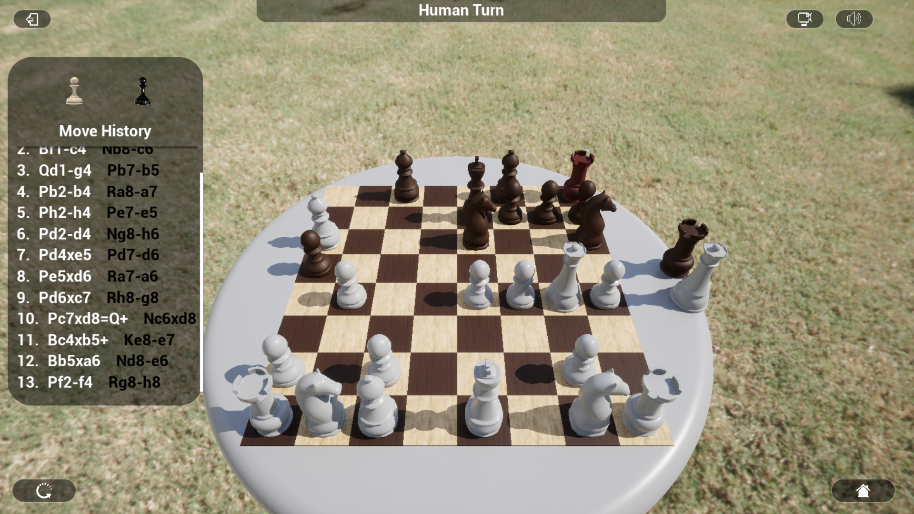

# **Chess in Unreal Engine 5**
## Info
- Chess game for an individual university project for Design and Analysis of Algorithms course at the University of Genoa
- Two algorithm used:
  * random: choose a random legal play
  * Alpha-Beta pruning minimax: choose a move based the result of the minimax algorithm with the optimization of the alpha-beta pruning
- Replay functionality and move history avaible using the chess long algebraic notation
- Possibility to choose between three difficulties:
     * easy: random player and free to replay
     * medium: minimax player and free to replay
     * hard: minimax player and no possibility to replay
## How to play
- Choose a difficulty from the starting menu
- When is your turn choose a white piece of the chessboard, the selected piece will be highlighted and the tiles where he can go with his legal moves will be marked, if there aren't tiles marked the piece doesn't have legal moves avible so you have to choose another piece
- To use the replay functionality:
  * Click on one of the moves on the list and after the click the chessboard will go back (or forward) to that move
  * Click again on the same move to start playing from that situation
### Technologies
- C++
- Unreal Engine 5.2

### Game Samples
Normal game

Selected Piece and avaible tiles
.png)
End game
.png)
Start game
.png)
